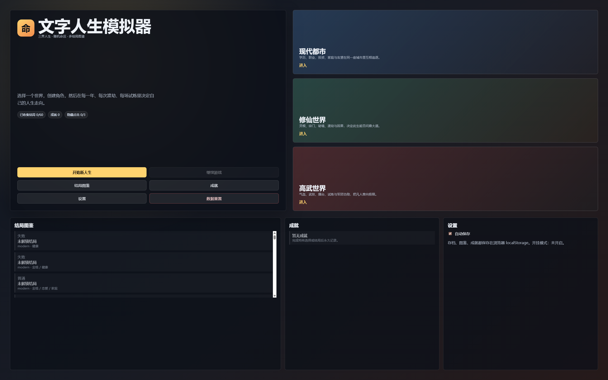

# 🎭 文字人生模拟器 (Text Life Simulator)

[](https://vitejs.dev/)
[](https://reactjs.org/)
[](https://www.typescriptlang.org/)
[](https://www.framer.com/motion/)

一个沉浸式的、多世界观的文字人生模拟器。在现代都市、修仙世界与高武世界中，通过每一次抉择书写独一无二的命运篇章。

[查看在线演示 (如果有的话)] | [提交 Bug](https://github.com/Noelune/text-life-simulator/issues)

---

## ✨ 核心特性

- **🌍 三大平行世界**：
  - **现代都市**：职场奋斗、财富经营、家庭生活。
  - **修仙世界**：寻仙问道、渡劫飞升、宗门争霸。
  - **高武世界**：气血突破、秘境探索、强者之路。
- **🎲 动态命运引擎**：基于随机事件与玩家属性的实时演算，每一局都是全新的体验。
- **🎨 现代视觉交互**：
  - **Glassmorphism**：磨砂玻璃质感 UI，精致的半透明视觉层次。
  - **Framer Motion**：平滑的入场动画与交互反馈。
  - **Lucide Icons**：直观的图标化数据展示。
- **📊 深度养成系统**：
  - **多维属性**：不仅是数值，更是你人生轨迹的证明。
  - **路线分支**：根据选择解锁不同的职业、宗门或武道路径。
  - **结局图鉴**：收集上百种不同稀有度的结局，解锁终极成就。
- **💾 自动存档**：基于浏览器 `localStorage`，随时随地继续你的精彩人生。

---

## 📸 界面预览

*(此处建议上传项目截图或 GIF 动图)*

<div align="center">
  
</div>

---

## 🛠️ 技术栈

- **框架**: React 19 + TypeScript
- **构建工具**: Vite 8
- **动画**: Framer Motion
- **图标**: Lucide React
- **样式**: Modern CSS (Native CSS Variables + Glassmorphism)

---

## 🚀 快速开始

### 本地开发

1. **克隆仓库**
   ```bash
   git clone https://github.com/Noelune/text-life-simulator.git
   cd text-life-simulator
   ```

2. **安装依赖**
   ```bash
   npm install
   ```

3. **启动项目**
   ```bash
   npm run dev
   ```

### 项目构建

```bash
npm run build
```

---

## 🗺️ 后续路线图 (Roadmap)

- [ ] **连续剧情链**：增加具有因果关系的深度故事线。
- [ ] **社交系统**：更复杂的人物交互与关系网。
- [ ] **多端适配**：进一步优化移动端的触摸操作体验。
- [ ] **数据导出**：支持存档导出与分享。

---

## 🤝 贡献指南

欢迎任何形式的贡献！无论是修复 Bug、改进 UI 还是增加新的世界/事件数据。

1. Fork 本仓库
2. 创建特性分支 (`git checkout -b feature/AmazingFeature`)
3. 提交更改 (`git commit -m 'Add some AmazingFeature'`)
4. 推送到分支 (`git push origin feature/AmazingFeature`)
5. 开启一个 Pull Request

---

## 📄 开源协议

本项目采用 MIT 协议开源。详情请参阅 [LICENSE](LICENSE) 文件。

---

<div align="center">
  由 <b>Noelune</b> 倾情打造
</div>
